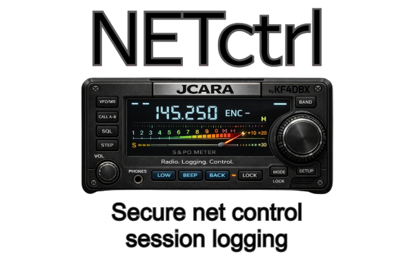
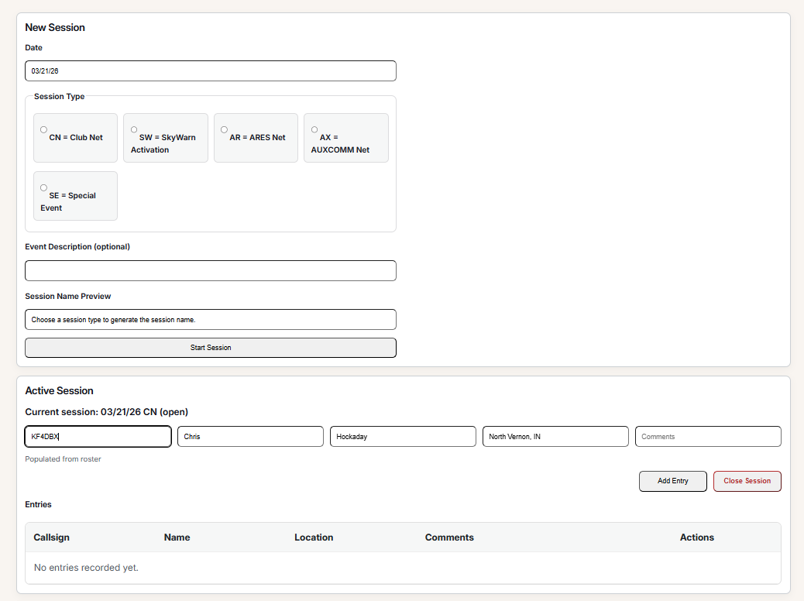
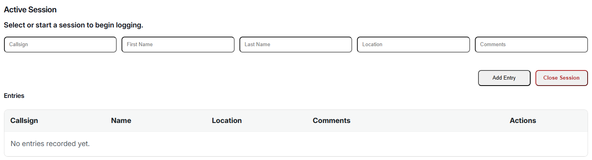
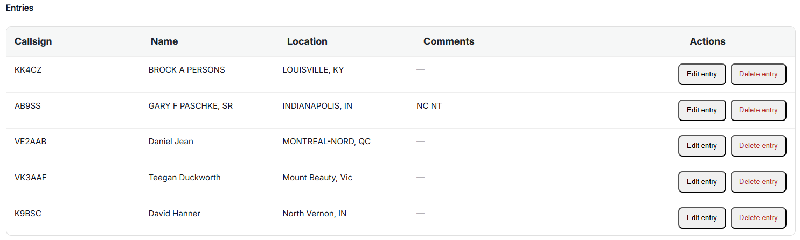
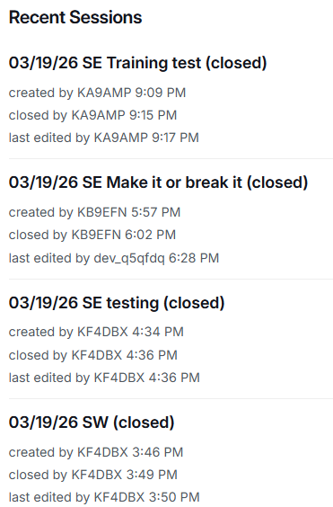
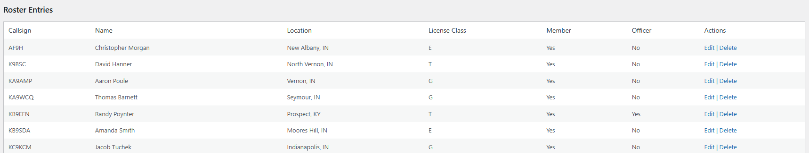
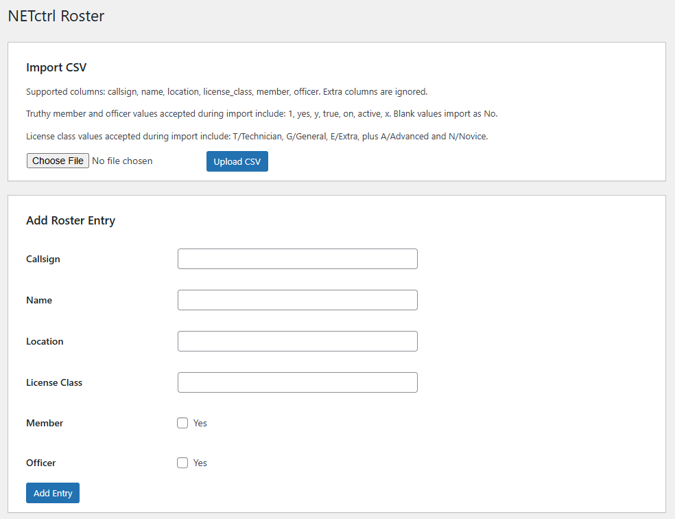
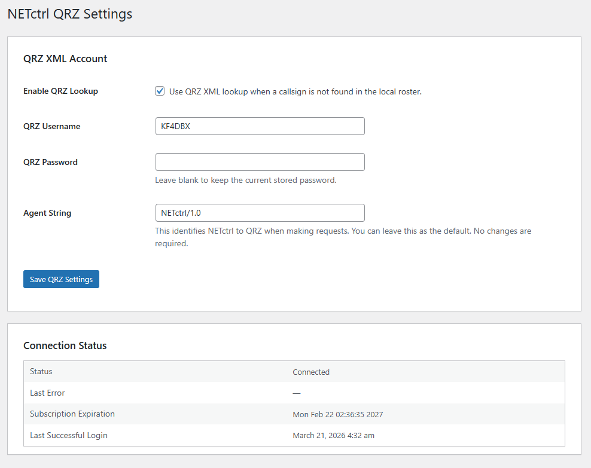
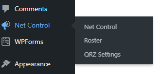
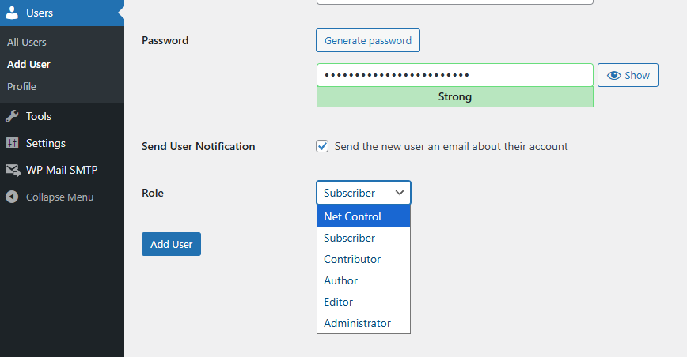

# NETctrl

NETctrl is a real time net control logging system built by Chris Hockaday / KF4DBX of the Jennings County Amateur Radio Association (JCARA).

  

The current public release is a WordPress plugin designed for amateur radio clubs, emergency communications groups, and other organizations that run regular nets. NETctrl is being built first in WordPress, with a longer-term roadmap that includes standalone, desktop and mobile versions so clubs can use the platform in more environments over time. It runs fine in mobile environments now, but feels a bit clunky for practical use.

From JCARA, NETctrl is intended to be useful well beyond a single organization and is open for adoption by other clubs and groups.

## Features

NETctrl focuses on practical, day-to-day net operations with a clean workflow for operators and administrators.

- Real time net control console for active sessions.
- Session creation and management from a single interface.
- Structured session naming for consistent logs.
- Check-in logging for stations as they join the net.
- Entry editing and deletion when corrections are needed.
- Recent sessions view for quick follow-up and review.
- Session audit notes that show who created, edited, and closed sessions.
- Admin-managed roster with callsign-based auto population.
- QRZ fallback lookup for non-roster callsigns when enabled.
- Role-based access using WordPress users and permissions.

## Interface Overview

The NETctrl console is designed for fast, real time net operations with minimal friction during active sessions.

  

### Active Session Logging

Operators can quickly log stations, edit entries, and manage traffic in real time during an active net.

  

### Entry Management

Each check-in can be edited or removed as needed, allowing operators to correct information without disrupting the session.

  

### Recent Sessions and Audit Trail

NETctrl keeps track of session history, including who created, edited, and closed each session with timestamps.

  

### Roster Management

Administrators maintain a centralized roster used to auto-populate operator details during sessions.

  

### CSV Import and Manual Entry

Rosters can be imported via CSV or managed manually through the admin interface.

  

### QRZ Integration

When a callsign is not found in the roster, NETctrl can optionally pull data from QRZ to assist operators during live logging.

  

### Admin Interface

Administrators have access to roster management, QRZ configuration, and system-level controls.

  

### Assigning Net Control Operators

Operators are created as standard WordPress users and assigned the **Net Control** role. This gives them access to the NETctrl console while restricting administrative functions.

  

## Installation

Install NETctrl in WordPress using the release package provided in GitHub Releases.

1. Download the plugin ZIP from the repository's **Releases** section.
2. In WordPress admin, go to **Plugins**.
3. Select **Add Plugin**.
4. Select **Upload Plugin**.
5. Upload the NETctrl ZIP file.
6. Select **Install Now**.
7. Activate the plugin.

**Important:** The ZIP package must contain the plugin root files directly. WordPress should see the `netctrl/` plugin files immediately inside the archive, not inside an extra nested folder created by manually zipping the repository.

## Configuration

After activation, complete the basic setup below.

### Create the operator console page

1. In WordPress admin, create a new page such as **Net Control Console**.
2. Add the shortcode `[netctrl_console]` to the page content and adjust your CSS accordingly, if needed.
3. Publish the page.
4. Share the public facing page URL with your operators.

Only logged-in users with NETctrl access can use the console.

### Create operator accounts

- Create a WordPress user account for each operator who will run sessions.
- Assign the user the **Net Control** role so they can access the console and log entries.
- Administrators retain full access automatically.

### Manage the roster

- Roster management is admin only.
- Administrators can import a CSV roster, add entries manually, edit records, and remove records.
- Operators can use roster-backed lookups during sessions, but they cannot manage roster data.

### Configure QRZ lookup

- QRZ settings are admin only.
- If your organization uses QRZ XML lookups, administrators can enable the feature and enter the account credentials in the QRZ settings screen.
- Operators benefit from the lookup during live logging, but they cannot change the QRZ configuration.

## Shortcodes

### `[netctrl_console]`

Displays the authenticated NETctrl operator console. This is the main interface used to:

- start a session
- log check-ins
- edit or delete entries
- review recent sessions
- close a session

### `[netctrl_log id="123"]`

Displays a session log for a specific session ID. This can be used for public or internal log pages, and users with NETctrl access can also use the available PDF download link for that session.

## Roles and access

NETctrl uses WordPress roles and capabilities to separate operator tasks from administrator tasks.

### Administrators

Administrators have full control, including:

- managing the roster
- managing QRZ settings
- creating and managing users
- running sessions and logging entries
- overall system administration

### Operators

Operators are users assigned to the **Net Control** role. They can:

- run sessions
- log entries
- edit and close sessions they are working
- use the console for day-to-day net operations

Operators cannot:

- edit the roster
- change QRZ settings
- change system-wide settings

## Roster CSV format

NETctrl supports roster imports by CSV to speed up initial setup and ongoing maintenance.

### Expected columns

The expected columns are:

- `callsign` - required
- `name`
- `location`
- `license_class`
- `is_member`
- `is_officer`

NETctrl will also accept common header variations such as `call_sign`, `call`, `member`, `officer`, `license`, and `class`.

### Acceptable values

For the `member` or `officer` fields, NETctrl accepts values such as:

- `1`
- `true`
- `yes`

These values are case insensitive. Blank values are treated as false.

A template is provided in Templates.

### How CSV upload works

- Upload the CSV file from the roster management screen in WordPress admin.
- NETctrl reads the first row as the header row.
- The `callsign` column is required.
- Existing callsigns are updated.
- New callsigns are added.

### Common CSV mistakes

- Missing the `callsign` column.
- Using a spreadsheet export that adds unexpected blank header cells.
- Uploading a file with the wrong delimiter or format instead of a true CSV file.
- Using inconsistent callsign formatting that creates duplicate-looking records.

## QRZ integration

NETctrl can optionally use QRZ XML lookups to help fill in missing station details.

- A QRZ XML subscription is required.
- An administrator must enter the QRZ username and password.
- The agent string defaults to `NETctrl/1.0` and can usually be left unchanged.

When QRZ lookup is enabled:

- NETctrl always checks the local roster first.
- QRZ is only used when the callsign is not found in the roster.
- Only the first name, last name and location are populated from QRZ.

This keeps local club data in control while still helping operators handle stations that are not yet in the roster.

## Roadmap

NETctrl is actively evolving. Planned areas of growth include:

- public session publishing and downloads
- non-WordPress deployment support
- desktop application support
- mobile application support

The long-term direction is to keep the WordPress release useful while expanding NETctrl into a broader platform for amateur radio organizations.

## Repository structure

The current plugin source is organized into a few main directories inside `netctrl/`:

- `admin` - WordPress admin pages and operator console integration.
- `assets` - stylesheets, scripts and static assets.
- `includes` - core plugin logic, database handling, capabilities, REST routes and integrations.
- `public` - public-facing shortcodes and related output.

## Development note

This repository contains the source code for NETctrl.

Installable plugin packages are provided through GitHub Releases. If you want to install NETctrl in WordPress, download the ZIP from **Releases** rather than cloning the repository or manually creating your own ZIP file from source.

## License

This project is licensed under the **GNU General Public License v2.0 or later (GPL-2.0-or-later)**.

This keeps NETctrl compatible with WordPress while ensuring the project remains open, community-driven and available for clubs and groups that want to build on it.
